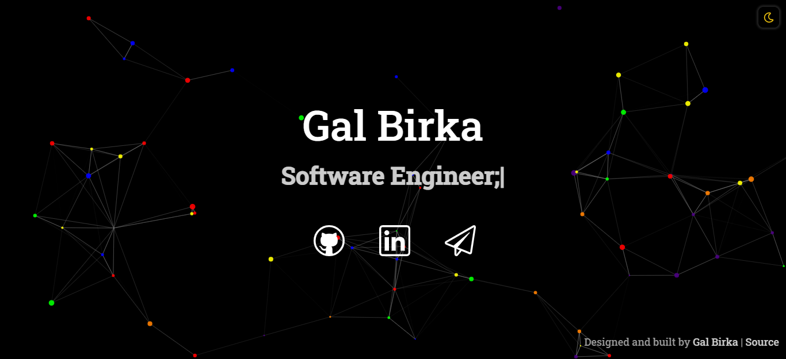

#  birkagal.com

> 💻 Simplistic, minimalist and interactive personal website built with
> [`React`](https://reactjs.org/).

This website's design is both simple and accessible. Dynamic particles create an experience that is interactive and visually inviting. The site offers two themes via a toggle, dark mode (default) and light mode. Once toggled, the selected theme should persist between tabs, windows, and page reloads.
The website is mobile friendly.

Hosted using `gh-pages` and can be found @ [birkagal.com](https://www.birkagal.com)

## <b>Install &amp; Setup</b>

1. Clone this repository
2. Install dependencies: `yarn install`
3. Start the development server: `yarn start`

<b>Build &amp; Deploy</b>

1. Create a production build: `yarn run build`
2. The [React/Deployment](https://create-react-app.dev/docs/deployment/) docs detail how to deploy to `gh-pages`, Netlify, and many other services

